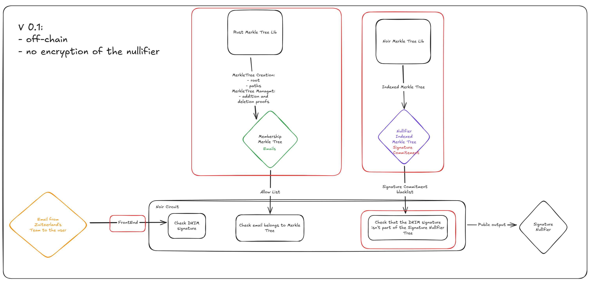
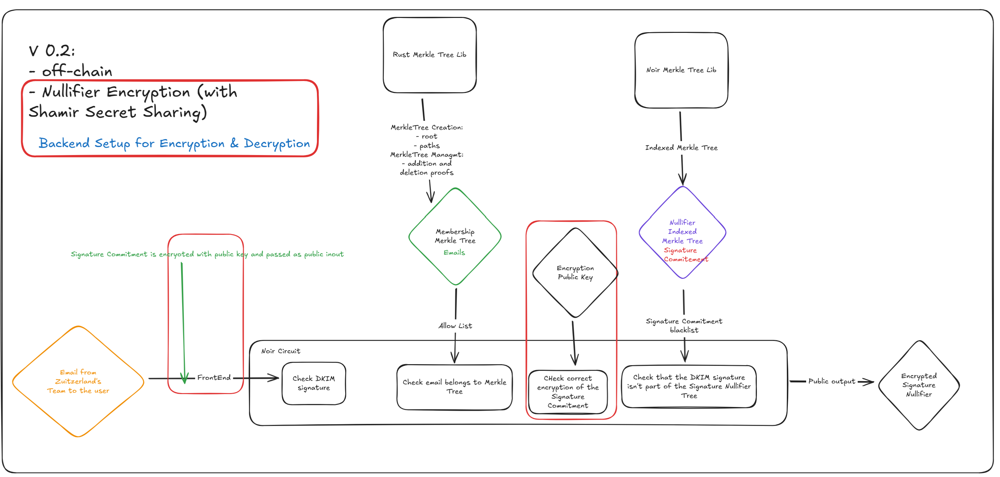
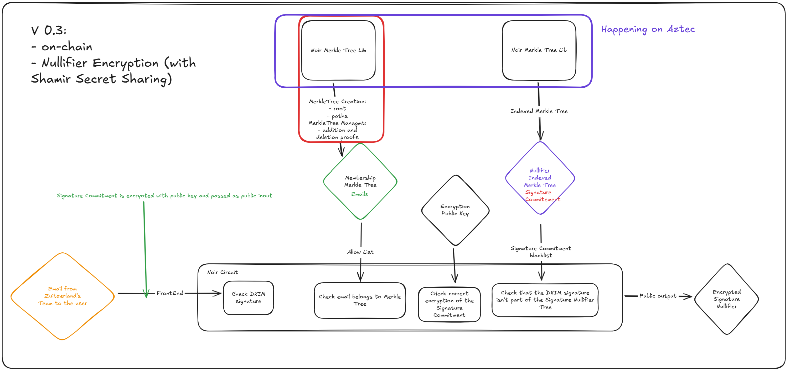
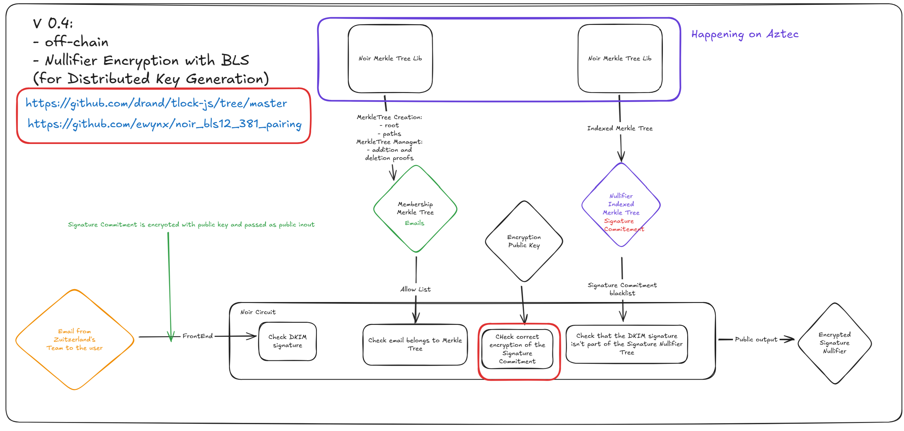

# zuitzAnon

# Introduction

**Zuitzerland** is a one-of-a-kind "pop-up village" experiment with strong decentralized-access (d/acc) vibes—think Zuzalu with a similar strong privacy focus. At this tiny scale, we've already achieved product–market fit: event organizers are clamoring for a self-hosted tool that lets attendees prove membership without exposing their identity while still being able to ban rule-breaking users.

---

## Problem

- **Anonymity**: Users should be able to login to any service without revealing their identity and linking their different sessions
- **Accountability**: Administrators should be able to prevent rule-breaking users from continuing.

---

## Our MVP: Anonymous Set-Membership Login

We've built a **Noir-powered** circuit that simultaneously:

1. **Verifies a user's OAuth2 JWT** (email identity)
2. **Proves membership** in the event's emails set

All in **one single zkSNARK proof**, submitted to the service provider.

- **Anonymous:** server only sees "✔️ someone from the event logged in"—no email, no profile.
- **Selective:** only pre-registered event participants can generate a valid proof.
- **Seamless:** attendees use the same email sign-in flow they already know; we just wrap it in a privacy layer.
- **Robust**: circonventing users can be banned from using the service without anyone knowing their identity or linking their sessions.

---

## Why Now?

- **Privacy is table stakes:** Small communities demand confidentiality.
- **d/acc momentum:** Experimental villages like Zuzalu/Zuitzerland/ZuBerlin prove there is appetite for decentralized, privacy-preserving tooling.
- **Noir + JWT + Semaphore + Nullifier Tree = sweet spot:** We combine well-tested building blocks into a turnkey solution.

---

## High-Level App Flow

There are two main actors:

- **Server** (run by the event core team; assumed honest; it can later be replaced by an on-chain functions to log the administrators' activities)  
- **Client** (an event participant who needs an anonymous credential to access the app)

### Steps

1. **Merkle Tree Setup (Server)**  
   - Core team collects the list of approved emails.  
   - Builds a Merkle tree over the email hashes.  
   - Publishes the Merkle root on the server.

2. **Path Distribution (Server → Client)**  
   - When participants arrive, the server provides each one with:  
     - The Merkle root  
     - Their unique Merkle path (siblings + indices)

3. **Login & Proof Generation (Client)**  
   - Participant signs in via Google OAuth2 → obtains a JWT.  
   - Client code automatically extracts the leaf (email hash) and uses:  
     - The JWT  
     - The Allow List Merkle Tree's root & path
     - The BlackList Merkle Indexed Tree's merkle root & path
     to generate **one** Noir zkSNARK proof that:  
     1. The JWT and the email are valid  
     2. That email’s hash is indeed in the Merkle tree (meaning it is an approved email)
     3. That email's hash isn't in the Nullifier Tree (meaning that it hasn't been banned)

4. **Verification & Access Grant (Client → Server)**  
   - Client POSTs the proof + public inputs (root, path, nonce, etc.) to `/api/verify-jwt-proof`.  
   - Server verifies the zkSNARK (and JWT logic) in one step.  
   - On success, the server issues an anonymous session token and grants app access.

5. **Administrator Action: User Ban (Server)**
   - Administrator updates the Nullifier Tree by adding the nullifier from the user's login proof and updating its merkle root.

## Next Milestones for **An elegand design**
  We are aware of the flaws of the current design: 
  - Unencrypted nullifiers can lead to linkability between the user's posts
    It is solved by encrypting the nullifier and verifying the encryption in the ZKP so the administrators can decrypt the nullifier without seeing the other similar nullifiers
  - Threshold encryption for the nullifiers avoids one administrator decrypting every nullifier by itself and requires an MPC between the administrators to decrypt a nullifier. The secret shares can be distributed amongst a large number of people to avoid collusion.
  - On-chain Trees with verifiable and rate limited (timelocks) functions to provide accountability for Administrators' actions.
  - On-chain messages to provide censorship resistance (messages can still be hidden on the frontend).
  - It is possible to use dRand as a randomness beacon to ban users only temporarily.
  - It is possible to give users several warnings to limit their actions without directly banning them.

*Here are multiple pictures illustrating the differences between the different versions:*





## Subsequent integrations
1. **Anonymous Forum**
- Leveraging the existant Discourse Forum, it is possible to add a new login method: zuitzAnon. Admins will be able to ban users without deanonymizing them. Admins can also be the users of the forum themselves.
2. **zuLink**
    Zulink can integrate zuitzAnon for its authentication mechanism and if someone abuse the service it can be banned for some time or permanently
1. **PCD Database**
   - Clients will store full Proof-Carrying Data (PCD) locally.
   - Server holds only **commitments + salts** in a Merkle tree for **unlinkable**, **auditable**, **private** storage of every proof generated during the event.
2. **Anonymous Transactions**
   - Leverage the same anonymous auth to enable write-access or tokens within the village app without deanonymizing users.
3. **Universal PCD Platform**
   - Extend beyond anonymous login: anonymous proofs of age, nationality, bank balances (via Open Banking), on-chain protocol interactions, wallet liquidity, and more.
   - One proof per credential, re-usable and privately verifiable on-chain or off-chain.

## Notes on constraint counts, proving times & UX considerations


We can see that the two most ressource intesive functions are the ones from the JWT library. It will be hard for us to bring this down, as it is an external library. We also note that our proving takes approximately 10 seconds. This is clearly above a usual Web2 UX experience, and thus we will explore alternative solutions for more comupte intensive proofs, like delegating to a coSNARK network, such as TACEO's.

---

Join us in making private, unlinkable, verifiable identity as easy as "login with email"—but so much more powerful.

---

## Demo Video:

https://github.com/user-attachments/assets/d749f6ea-8b5b-4ec8-96e2-49977d8ca26a


**Notes on testing by judges**: 
- The lenght of the JWT is of max 910 data bytes. We must add dynamic max lenght of JWT according to user's email and JWT. As such, for now it only works for a subset of global JWT, of lenght less or equal to 910. 
- Merke Tree has been hard coded by ourselves, as testing purposes, and thus only our email are whitelisted.

## Prerequisites

- Node.js (v18 or higher)
- npm or yarn
- Google OAuth2 credentials

## Quick Start

1. **Clone the repository:**

```bash
git clone git@github.com:ZuitzAnon/zuitzAnon-main.git
cd Noir-Hack/zauth
```

2. **Install dependencies:**

```bash
# Server dependencies
cd verifier
npm install

# Client dependencies
cd ../client
npm install
```

3. **Configure environment variables:**

- In `zauth/client/`, create a `.env` file:
  ```env
  VITE_GOOGLE_CLIENT_ID=your-google-client-id
  VITE_REDIRECT_URI=your-redirect-uri
  ```

4. **Start the development servers:**

```bash
# Start the server (from verifier directory)
npm run dev

# Start the client (from client directory)
npm run dev
```

5. **Merkle Proof Configuration:**

- The server computes the Merkle root from whitelisted emails and, after login, returns the Merkle root, the user's index, and proof siblings to the client whenever he gets whitelisted.
- The client uses these values to generate a proof. The `proofConfig.json` file is only a fallback/example; in production, proof data comes from the server.
